# Overview

The Continuous Integration/Continuous Delivery (CI/CD) Pipeline project is designed to automate the process of building, testing, and deploying applications on the Microsoft Azure platform. By implementing CI/CD practices, this project aims to increase development efficiency, reduce manual errors, and enable rapid and reliable software delivery.

In this project, we leverage Azure DevOps principles and practices to create a robust CI/CD pipeline. The pipeline automates the entire software delivery process, from source code management to deployment, ensuring that every change made to the application is thoroughly tested and deployed to production seamlessly.

Key Features:

* Integration with Azure Cloud Shell for Continuous Integration
* GitHub Actions for automated testing and linting
* Azure Pipelines for deploying the application to Azure App Services
* Load testing using Locust to ensure application scalability and performance

By following this project, you will gain hands-on experience in setting up a CI/CD pipeline using Azure DevOps tools and practices. You will learn how to automate the build, test, and deployment process, enabling you to deliver high-quality software faster and more efficiently.

[](https://github.com/mitin99/uda-devops-project2/actions/workflows/main.yml)

## Project Plan

* [Trello Board](https://trello.com/invite/b/mP3tmJVl/ATTI06163ce0805d4b46608c45520b8822bfC0C21F13/udacity-devops-project-2)
* [Spread sheet](https://docs.google.com/spreadsheets/d/12I2MgZaNVbrnGZU8UbnMait3Uy1QZvg4mMwyZTBKGHo/edit?usp=sharing)

## Instructions

* Architectural Diagram (Shows how key parts of the system work)
  
* Project cloned into Azure Cloud Shell
  `git clone https://github.com/mitin99/uda-devops-project2.git`
  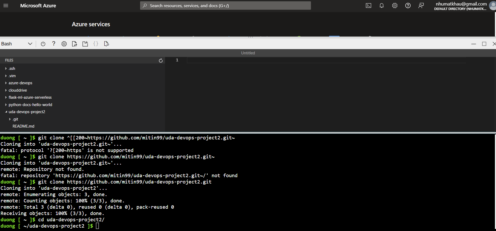
* Change into the new directory:
  `cd uda-devops-project2`
* Create a virtual environment:
  `make setup`
* Activate the virtual environment:
  `source ~/.udacity-devops/bin/activate`
* Install dependencies in the virtual environment and run tests:
  `make all`
* Passing tests that are displayed after running the `make all` command from the `Makefile`
  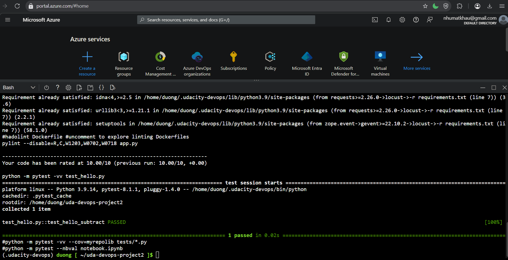
* Deploy web app to Azure App Service
  `az webapp up -n uda-devops-projects --location southeastasia --sku B1`
  or run commands.sh: `./commands.sh`
* Project running on Azure App Service
  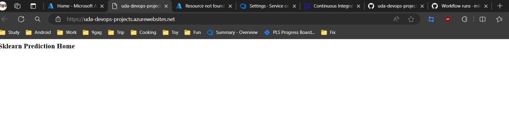
  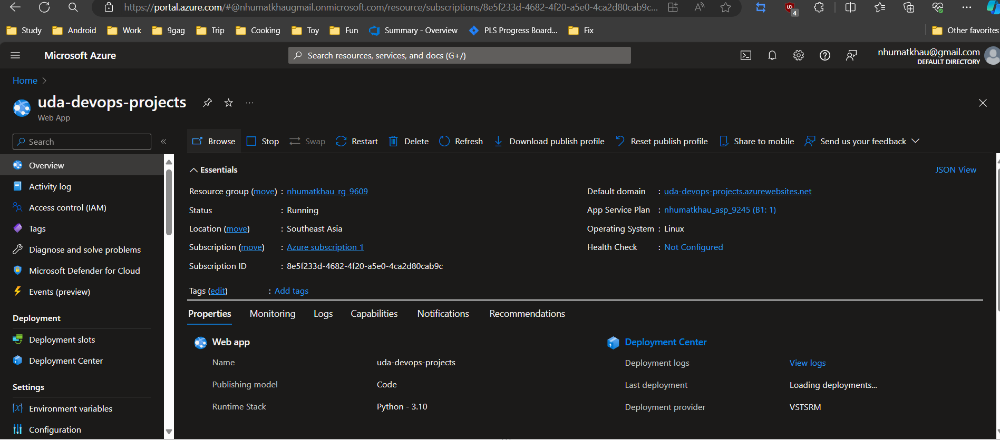
* Successful deploy of the project in Azure Pipelines.  [Note the official documentation should be referred to and double checked as you setup CI/CD](https://docs.microsoft.com/en-us/azure/devops/pipelines/ecosystems/python-webapp?view=azure-devops).
  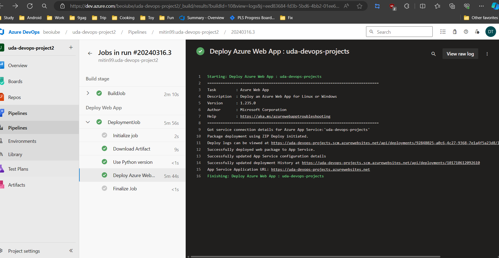
* Running Azure App Service from Azure Pipelines automatic deployment
  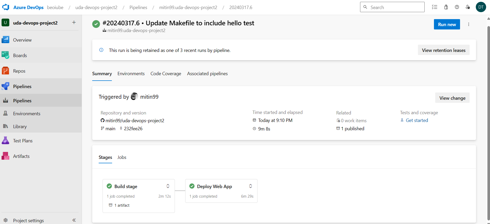
* Successful prediction from deployed flask app in Azure Cloud Shell.  [Use this file as a template for the deployed prediction](https://github.com/udacity/nd082-Azure-Cloud-DevOps-Starter-Code/blob/master/C2-AgileDevelopmentwithAzure/project/starter_files/flask-sklearn/make_predict_azure_app.sh).
  The output should look similar to this:

```bash
udacity@Azure:~$ ./make_predict_azure_app.sh
Port: 443
{"prediction":[20.35373177134412]}
```

* To run the prediction: `./make_predict_azure_app.sh`
  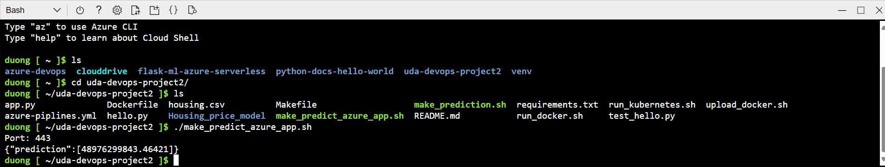
* Output of streamed log files from deployed application: `az webapp log tail`
  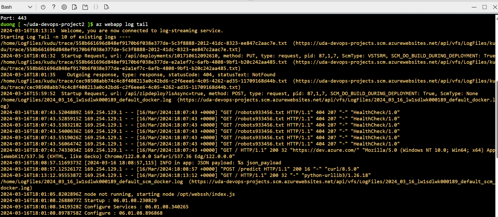
* Testing with Locust:
  ** Run the code in local, install Locust: `pip install locust`
  ** Run Locust: `./locust_test.sh`
  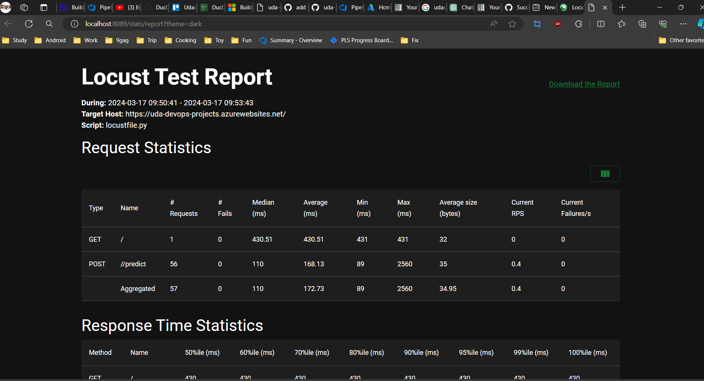
  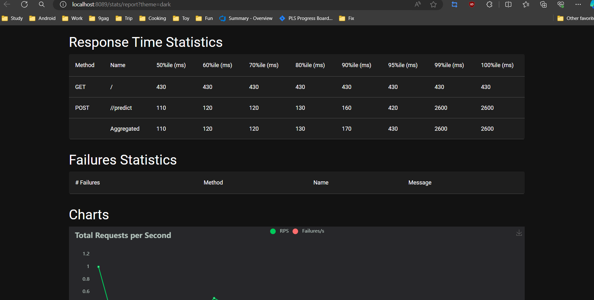
  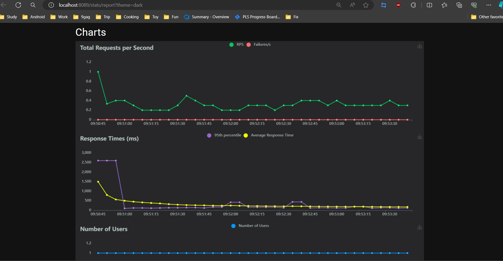
  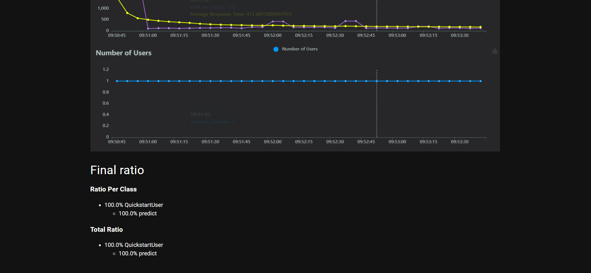

## Enhancements

* UI design
* Pipeline improvement
* ML model upgrade

## Demo

[Short instructions for Udacity &#34;Building a CI/CD Pipeline&#34; Project - by Dương Minh Tiến (youtube.com)](https://www.youtube.com/watch?v=6OhMeCxGNms&t=1s)
